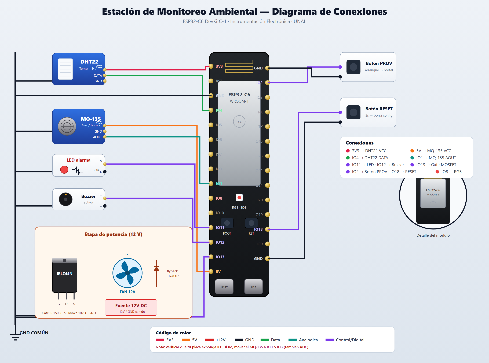

# Estación de Monitoreo Ambiental con Control de Extractor

**Universidad Nacional de Colombia · Instrumentación Electrónica · 9° Semestre**

Sistema embebido sobre **ESP32-C6** que mide temperatura y nivel de gases combustibles y acciona un extractor cuando la concentración supera un umbral. El control parte de una estrategia **ON/OFF con histéresis** y deja la arquitectura lista para control **PID por PWM** sobre la velocidad del extractor.

Incluye **aprovisionamiento WiFi por portal cautivo** (sin reflashear para cambiar de red), telemetría a **AWS IoT Core** (MQTT sobre TLS + Device Shadow) y un **dashboard web** alimentado por un broker MQTT público. Desarrollado con **ESP-IDF** y **FreeRTOS**.

---

## Características

- **Portal cautivo de configuración** — el dispositivo levanta un Access Point, escanea las redes disponibles (con nivel de señal), y permite ingresar credenciales WiFi y umbrales desde el navegador. Todo se guarda en NVS: **no hace falta reflashear** ni editar código para cambiar de red.
- **Configuración persistente en NVS** — redes WiFi (hasta 3, con prioridad), endpoint/thing de AWS y umbrales de temperatura y humo.
- **Botón de reset de configuración** — pulsación larga (3 s) durante operación borra credenciales y reinicia al portal cautivo.
- **LED RGB de estado** — 4 estados distinguibles: rojo lento (portal cautivo), naranja rápido (buscando WiFi), azul fijo (conectado), magenta pulsando (botón RESET sostenido, cuenta regresiva).
- **Telemetría dual** — AWS IoT Core (TLS + Device Shadow para recordar estado tras corte de luz) y broker emqx público para el dashboard en tiempo real.
- **Control ON/OFF con histéresis** sobre el extractor, con arquitectura PWM (LEDC) lista para PID.
- **Indicadores binarios** — LED rojo al superar umbral crítico de gas o temperatura; LED verde encendido cuando todo está en condiciones normales.
- **Pantalla OLED SSD1306 (I2C)** — interfaz local con encabezado, lectura de temperatura, lectura de gas y estado del extractor; la línea de estado se invierte cuando hay alarma activa.

---

## Estructura del repositorio

```text
environmental-monitoring-station/
├── main/
│   ├── main.c              # app_main, WiFi/STA, MQTT, control y alarma
│   ├── app_config.c/.h     # Configuración persistente en NVS
│   ├── provisioning.c/.h    # Portal cautivo (SoftAP + DNS + HTTP + mDNS)
│   ├── status_led.c/.h     # LED RGB de estado (WS2812)
│   ├── secrets.h.example   # Plantilla de credenciales (copiar a secrets.h)
│   ├── idf_component.yml   # Dependencias gestionadas (mdns, led_strip)
│   └── CMakeLists.txt
├── docs/                   # Dashboard web (GitHub Pages)
│   ├── dashboard.html      # Panel en tiempo real (MQTT sobre WebSocket)
│   └── index.html          # Redirección al dashboard
├── sdkconfig.defaults      # Configuración reproducible (target, flash, particiones)
├── CMakeLists.txt
├── .devcontainer/          # Entorno reproducible
├── .vscode/                # Configuración del editor
└── .clangd
```

---

## Flujo de funcionamiento

```text
Arranque → carga config (NVS)
  ├── Sin credenciales → PORTAL
  └── Con credenciales → STA → AWS IoT + emqx → tarea de sensores

Portal cautivo (red "EnvStation-XXXX", http://estacion.local):
  escanear redes → elegir → contraseña → (avanzado: AWS, umbrales)
  → guardar en NVS → reiniciar → conecta solo

En operación: mantener botón GPIO18 por 3 s → borra credenciales → portal
```

---

## Componentes de hardware

| Categoría | Componente | Función |
|-----------|-----------|---------|
| Sensor ambiental | DHT22 | Temperatura (one-wire) — la humedad del sensor no se utiliza |
| Sensor de gases | MQ-2 | Detección de gases combustibles y humo: GLP, propano, metano, hidrógeno, alcohol, humo |
| Actuador | Ventilador / extractor DC 12 V | Renovación de aire bajo alarma |
| Driver de potencia | MOSFET IRLZ44N + diodo flyback | Conmutación del extractor (lógica 3.3 V, carga 12 V) |
| Indicadores | LED RGB onboard, LED rojo de alarma, LED verde de estado OK | Estado de red y condición ambiental |
| Pantalla | OLED SSD1306 128x64 I2C (0x3C) | Visualización local de temperatura, gas y estado del extractor |
| Botón | Pulsador a 3V3 | Reset de configuración por pulsación larga |
| Embebido | ESP32-C6 | Control + conectividad (WiFi 6 / BLE 5) |

---

## Pinout (ESP32-C6)

| Señal | GPIO | Notas |
|-------|------|-------|
| DHT22 DATA / NTC | GPIO4 | One-wire (maqueta) o NTC por ADC1_CH4 (simulación) |
| MQ-2 AOUT | GPIO1 | ADC1_CH1 |
| Extractor (gate MOSFET) | GPIO13 | PWM (LEDC) / ON-OFF |
| LED alarma | GPIO11 | LED rojo |
| LED estado OK | GPIO12 | LED verde encendido en condición normal |
| LED RGB de estado | GPIO8 | WS2812 onboard (DevKitC-1) |
| Botón reset config | GPIO18 | A 3V3, pull-down interno. 3 s en operación → portal |
| OLED SDA | GPIO21 | I2C — bus compartido con futuras periféricas |
| OLED SCL | GPIO22 | I2C — pull-ups externos de 4.7 kΩ a 3V3 |

---

## Diagrama de conexiones



> Fuente vectorial editable: [`docs/diagrama_conexiones.svg`](docs/diagrama_conexiones.svg)

---

## Estrategia de control

| Modo | Descripción |
|------|-------------|
| ON/OFF + histéresis | Si el gas supera el umbral de encendido, el extractor arranca al 100 %; se apaga al bajar del umbral inferior (85 % del de encendido). Evita el titileo. Mínimo viable. |
| PID por PWM | (Fase 2) Control modulando la velocidad del extractor vía LEDC según concentración o temperatura. |

Los umbrales (temperatura en °C y nivel de humo en %) se configuran desde el portal cautivo.

---

## Stack tecnológico

| Herramienta | Uso |
|-------------|-----|
| ESP-IDF v5.5 | Framework principal |
| FreeRTOS | Multitarea |
| esp_adc | Lectura del MQ-2 / NTC |
| LEDC | PWM del extractor |
| esp_http_server + mdns | Portal cautivo |
| esp-mqtt + TLS | Telemetría a AWS IoT Core y emqx |
| led_strip | LED RGB de estado |

---

## Compilar y flashear

Requiere [ESP-IDF v5.5+](https://docs.espressif.com/projects/esp-idf/).

```bash
# 1. Credenciales y certificados (no versionados)
cp main/secrets.h.example main/secrets.h     # editar endpoint/thing de AWS
# Colocar los certificados X.509 en main/certs/:
#   aws_root_ca.pem, aws_device_cert.pem, aws_device_key.pem

# 2. Target (flash y particiones vienen de sdkconfig.defaults)
idf.py set-target esp32c6

# 3. Compilar, flashear y monitorear
idf.py -p COM<X> flash monitor
```

Primer arranque: el equipo crea la red **EnvStation-XXXX**. Conéctate desde el celular, abre `http://estacion.local` y configura tu red WiFi.

Para salir del monitor: `Ctrl + ]`

---

## Autor

**Yeison Dénnir Termal Cuastumal**  
Ingeniería Electrónica — Universidad Nacional de Colombia · 2026  
[GitHub](https://github.com/DENCODE31)


---

## Estado del proyecto

**COMPLETADO** — Semestre 2026-1 cerrado.

- Fecha cierre: 2026-06-18
- Materia: INSTRUMENTACION
- Entrega: aprobada
- Estado código: funcional, archivado